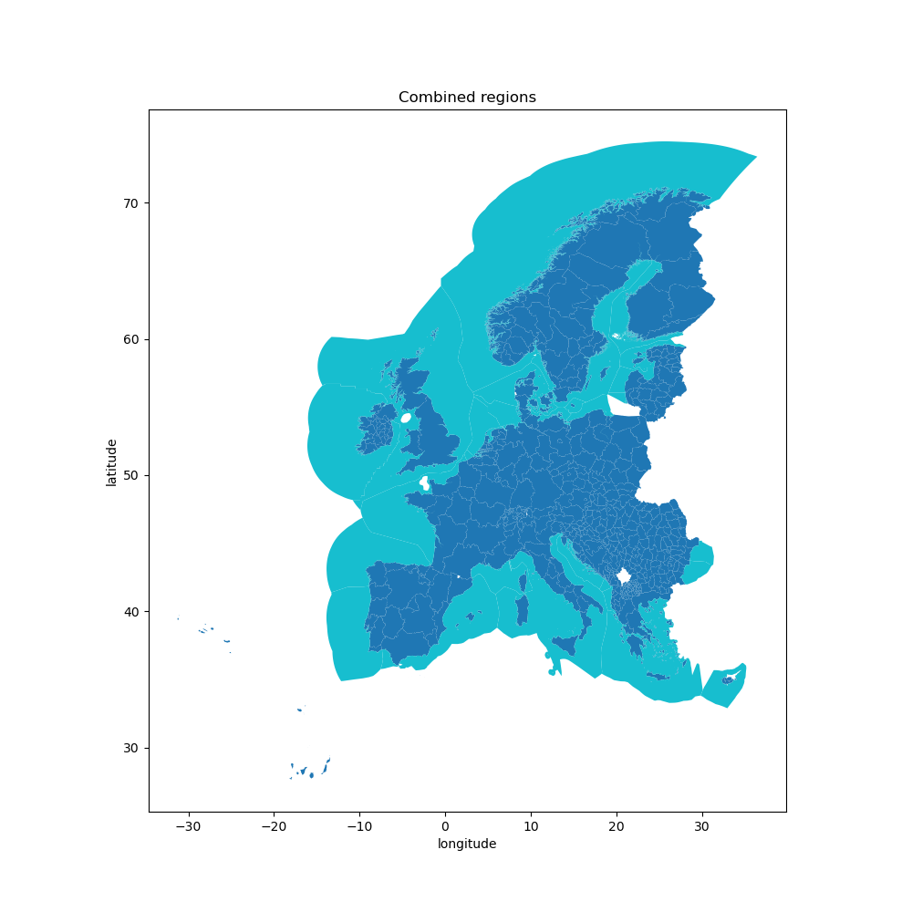

# clio - Geo-boundaries module

A data module to create arbitrary regional boundaries for energy systems modelling.



A modular `snakemake` workflow built for [`clio`](https://clio.readthedocs.io/) data modules.

## Steps

1. Data is downloaded and harmonized using a common schema (see `workflow/internal/shape.schema.yaml`).
    - Country area data: [GADM](https://gadm.org/), [Overture Maps](https://overturemaps.org/) and [NUTS](https://ec.europa.eu/eurostat/web/gisco/geodata/statistical-units/territorial-units-statistics) divisions are supported as datasources.
    - [Marine regions](https://www.marineregions.org/) Exclusive Economic Zone (EEZ) data.
2. Country area is clipped using the marine regions to accurately approximate their landmass.
3. The marine data and the clipped land mass data are combined following the schema.
Contested EEZ's (e.g., Taiwan, Falkland islands) are removed during this step.

## Using this module

This module can be imported directly into any `snakemake` workflow.
Please consult the integration example in `tests/integration/Snakefile` for more information.

## Development

We use [`pixi`](https://pixi.sh/) as our package manager for development.
Once installed, run the following to clone this repo and install all dependencies.

```shell
git clone git@github.com:calliope-project/module_geo_boundaries.git
cd module_geo_boundaries
pixi install --all
```

For testing, simply run:

```shell
pixi run test-integration
```

To view the documentation locally, use:

```shell
pixi run serve-docs
```

To test a minimal example of a workflow using this module:

```shell
pixi shell    # activate this project's environment
cd tests/integration/  # navigate to the integration example
snakemake --use-conda --cores 2  # run the workflow!
```
